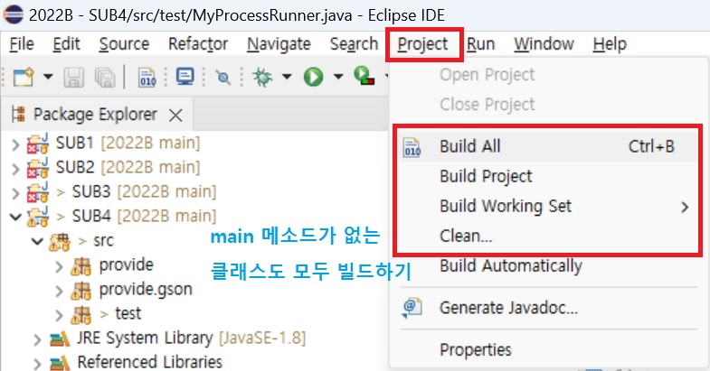
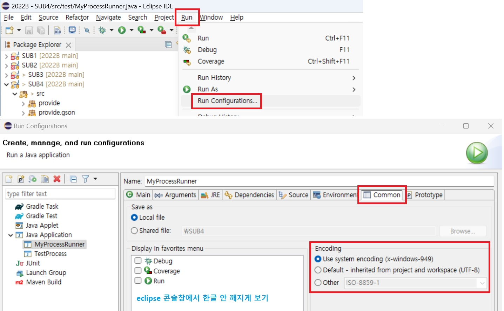

# javastudy

## 커맨트 창에서 java 실행

```shell
java -classpath C:/workspace/javastudy/bin/*;C:/workspace/javastudy/lib/*;. com.test.HelloWorld
```

## eclipse 프로젝트 안에 모든 클래스 컴파일하기


## eclipse 콘솔에서 한글 안 깨지게 보기

